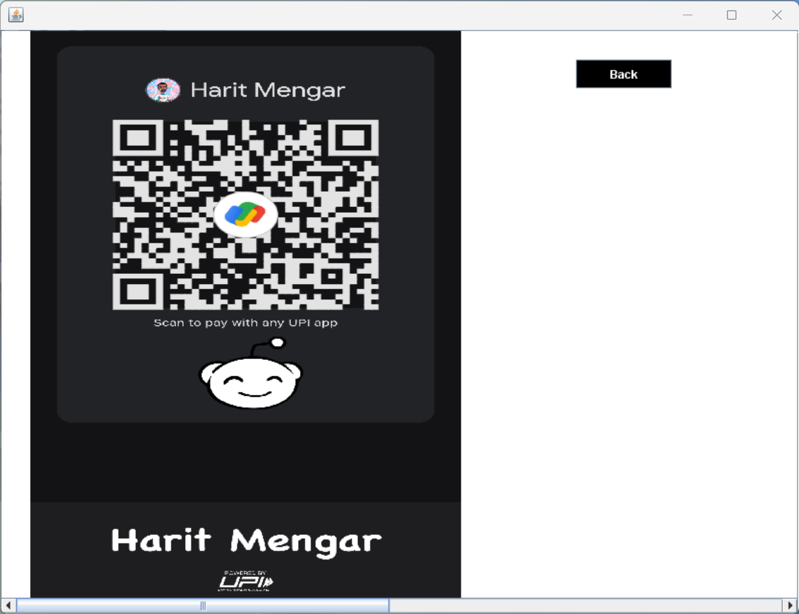

# 🚀 Travel Management System

A comprehensive **Tour and Travel Management System** developed using **Java, Java Swing, and MySQL**. This is my first fully functional project utilizing a database system like MySQL.

---

## 🌟 Features

- **User Authentication:** Secure login, signup, and password recovery.
- **Personal Details Management:** Add, update, view, and delete personal details.
- **Package Booking:** Browse, book, and review travel packages.
- **Hotel Management:** View and book hotels, review your bookings.
- **Payment Integration:** Simplified payment process via Paytm.
- **Database Connectivity:** Seamless integration with MySQL for data management.

---

## 🛠 Project Structure

- **Icons:** All image icons are located in the `icons` folder.
- **Source Code:** The complete source code can be found in the `src/travel/management/system` directory.
- **Database:** The project uses MySQL to manage and store data.

---

## 🎬 Getting Started

### 1️⃣ Login

- Open the login screen and enter your username and password.

  

- If you're new, proceed to the signup page.

  

- Forgot your password? Navigate to "Forgot Password," enter your username, and answer the security question to retrieve it.

  

### 2️⃣ Welcome Screen

- Upon successful login, you will be greeted with a welcome note.

  

### 3️⃣ Main Dashboard

- The core of the system—access all features from this central hub.

  

#### Features:

- **Logout:** Return to the login page.
- **Add Personal Details:** Input and save your personal information.

  

- **Update Details:** Modify previously saved information.

  

- **View Personal Details:** Review your submitted details.

  

- **Delete Details:** Remove all your personal data from the system.
- **Check and Book Packages:** Explore available travel packages and make bookings.

  

- **View Booked Packages:** Review your booked travel packages.

  

- **View and Book Hotels:** Browse and reserve hotels for your trips.

  

- **View Booked Hotels:** See the hotels you've reserved.

  

- **Payment:** Make payments via Paytm (please do not proceed unless you wish to support my work).

  

- **Destinations:** (Coming Soon) Explore exciting travel destinations.
- **About:** Learn more about the project and its functionalities.

### 4️⃣ Database Connectivity

- The `Conn.java` file handles the connection between the system and the MySQL database.

  

---

## 🤝 Contributions

Contributions are welcome! If you would like to improve the project or add new features, please refer to the contribution guidelines in the repository.

---

## 📜 License

This project is licensed under the [MIT License](LICENSE).

---
